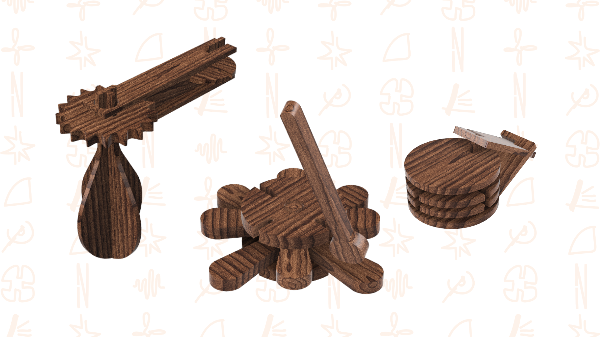
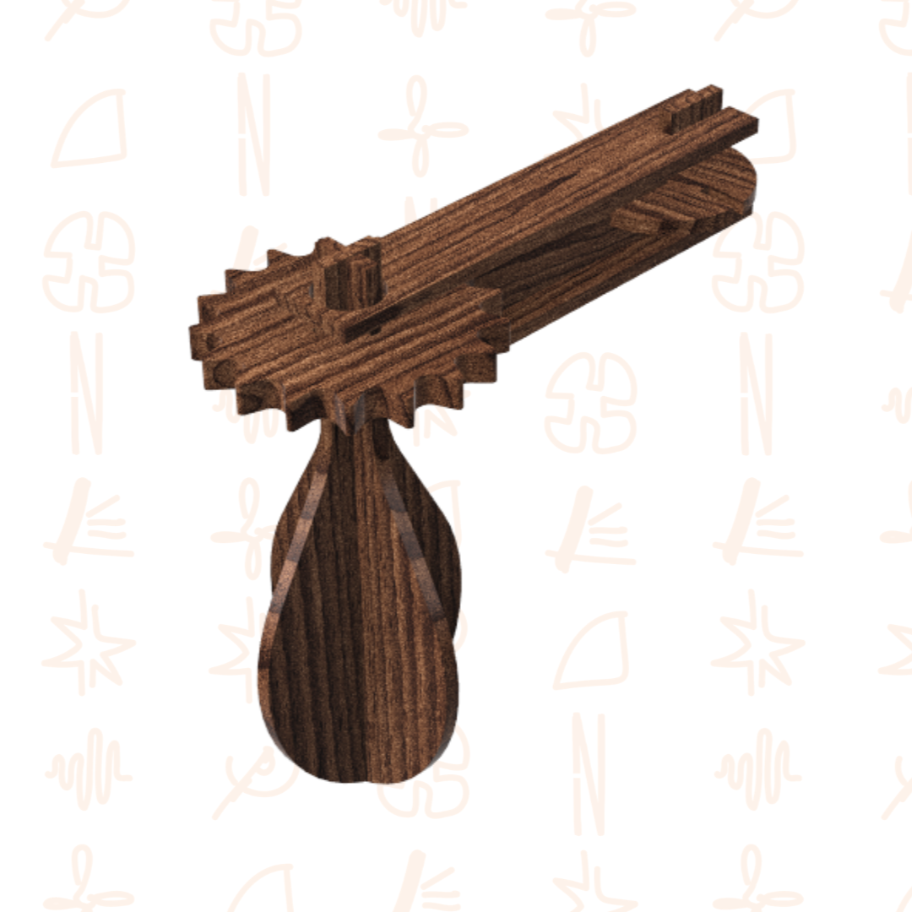
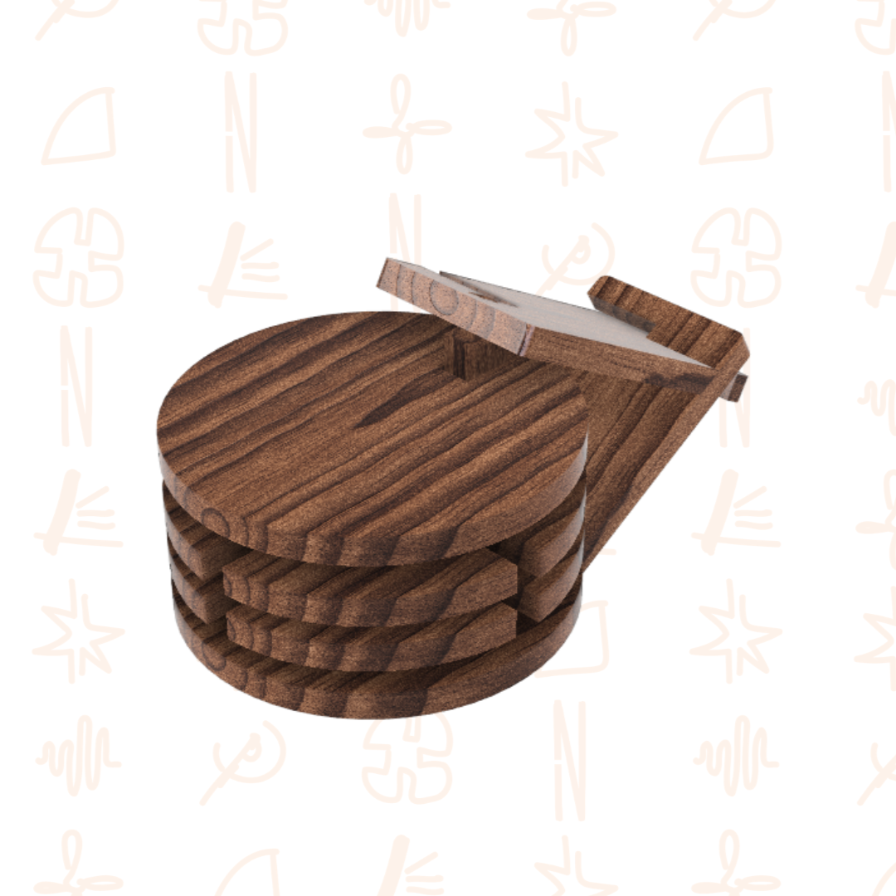
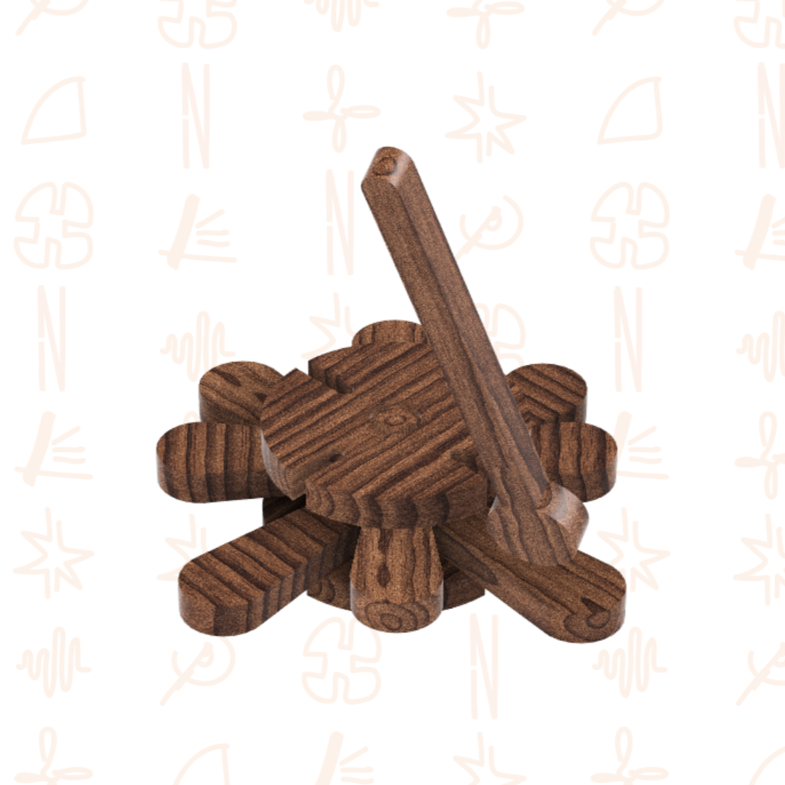

# Toca a Brincar!

> Brinquedos que se unem com os seus encaixes e pelo batuque da madeira que dá vida ao som e à animação!

## Elementos do Grupo

| Número  | Nome          |
| ------- | ------------- |
| 2024296 | João Silva    |
| 2024336 | Kenai Barbosa |
| 2024277 | Matilde Jorge |

---

## Contexto de Design

> Os brinquedos do grupo *Toca a Brincar!* da Nestor focam-se na ligação da música com uma brincadeira lúdica e exploratória proporcionada pelos encaixes com as combinações entre peças.
> Perceba mais sobre o que orientou conceitualmente o grupo para o desenvolvimento destes brinquedos através do contexto abaixo disponibilizado. 

[Ver contexto completo →](contexto.md)

---

## Galeria de Produtos

<!-- Cada thumbnail liga à página individual de cada produto.
     Cada produto vive em produtos/<numero>-<nome>/index.md
     e tem uma sub-página produtos/<numero>-<nome>/processo.md -->

<!-- markdownlint-disable MD033 -->

  <!-- duplicar o bloco abaixo para cada produto do grupo -->

  <a class="gallery-card" href="produtos/joão/">
    
    <h3>Matraca</h3>
    
João Silva

  </a>
  <a class="gallery-card" href="produtos/kenai/">
    
    <h3>Castanholas</h3>
    
Kenai Barbosa

  </a>  
  <a class="gallery-card" href="produtos/matilde/">
    
    <h3>Xilofone</h3>
    
Matilde Jorge

  </a>
  <!-- duplicar o bloco acima para cada produto do grupo  e substituir _modelo em ambas por <numero>-<nome> -->

<!-- markdownlint-enable MD033 -->
