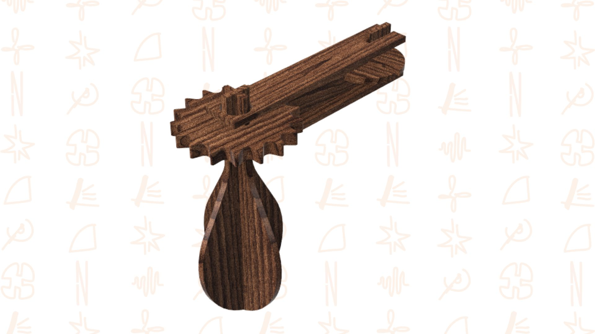

# Matracas

> Frase-conceito (uma linha): qual é a proposta?

A página deve tornar **visualmente percetível** a estratégia de resposta ao enunciado.
Segue a estrutura de **prancha-resumo** + **esquema-base** (C-E-T-F).

## Conceito

Matraca sonora transformável a partir de peças planificadas. Produto lúdico que resgata um brinquedo tradicional de percussão, dirigido a crianças (e também adultos) interessadas em explorar ritmos e sons percussivos de forma ativa. A ideia central é unir construção manual (montagem) e experiência sonora bruta, seca e estalada.

## Enquadramento

A matraca comunica com a castanhola e o xilofone por três vias: material (todos em madeira), construtiva (os três utilizam sistemas de encaixe sem colas ou parafusos, permitindo montagem e desmontagem manual) e sonora (percussão). Num pequeno trio, o xilofone faz a melodia, a castanhola o ritmo acentuado e a matraca preenche com um ritmo acelerado e constante, completando a rítmica que os outros dois não cobrem. O encaixe é o elo físico que une os três brinquedos na mesma linguagem de construção.

## Tecnologia

Material: Madeira de Nogueira.
Fabrico: Corte a laser ou CNC para precisão das engrenagens/eixos.
Software: Paramétrico (Autodesk Fusion 360).
Ficheiros: DXF para corte, STEP/STL para modelação, PDF para planificação de montagem.

- Modelo 3D: https://a360.co/4x29iiJ
- Ficheiros: `attachments/`

## Função

Como brincar: Girar a manivela ou haste, o mecanismo interno produz cliques secos e rítmicos.
Idade-alvo: 3+ anos (sob supervisão para peças pequenas).
Montagem: Encaje simples sem cola ou com fixações leves.
Diretiva 2009/48/CE (Segurança de Brinquedos):
Peças bem fixadas para evitar ingestão.
Sem pontas afiadas, arestas arredondadas.
Madeira não tóxica (sem lascas soltas).
Som com intensidade controlada (< 80 dB junto ao ouvido).
Necessário ensaio de impacto e compressão para evitar rutura que liberte componentes pequenos.

## Apresentação

Imagens-chave que sintetizam o produto final.

---

## Processo

O percurso completo de iterações, modelos e pesquisa está em [processo.md](processo.md), organizado do **mais recente** para o **mais antigo**.

[Ver processo completo →](processo.md)
