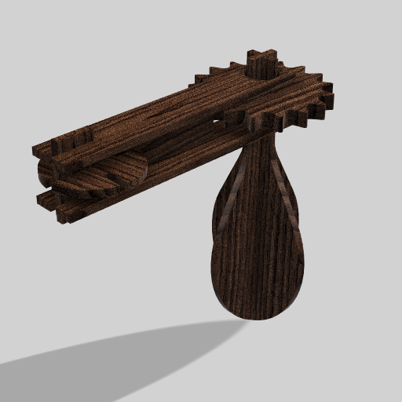
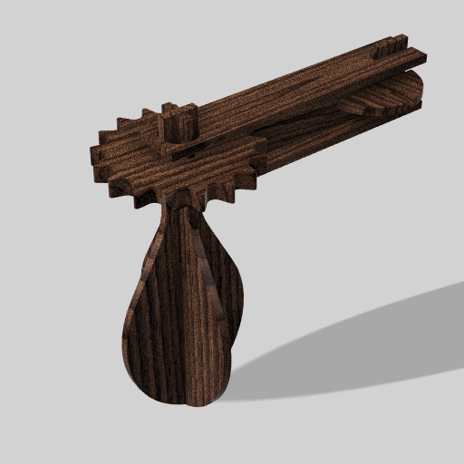

# Processo

## 1. Protótipo/ Versão Final

As imagens que seguem foram capturadas recorrendo ao software Autodesk Fusion 360 do modelo 3D final do brinquedo dada a impossibilidade de realizar os protótipos finais atempadamente.

## 2. Modelos 3D

https://a360.co/4x29iiJ
## 3. Outros Modelos

Modelos físicos exploratórios, em cartão, espuma, madeira de teste.

## 4. Esboços e Pranchas-Resumo

### 4.1. Esboços iniciais

### 4.2. Prancha-Resumo inicial

### 4.3. Prancha-Resumo Final

## 5. Pesquisa

### 5.1. Aspectos valorizados do moodboard, desconstrução da forma (o que distingue o programa formal)

### 5.2. Objetos de referencia

Inventário de precedentes, brinquedos análogos, referências históricas.

## 6. Outros Elementos

Outros materiais relevantes para a preparação do conceito (entrevistas, observação, testes com utilizadores, notas, leituras, inspirações).
