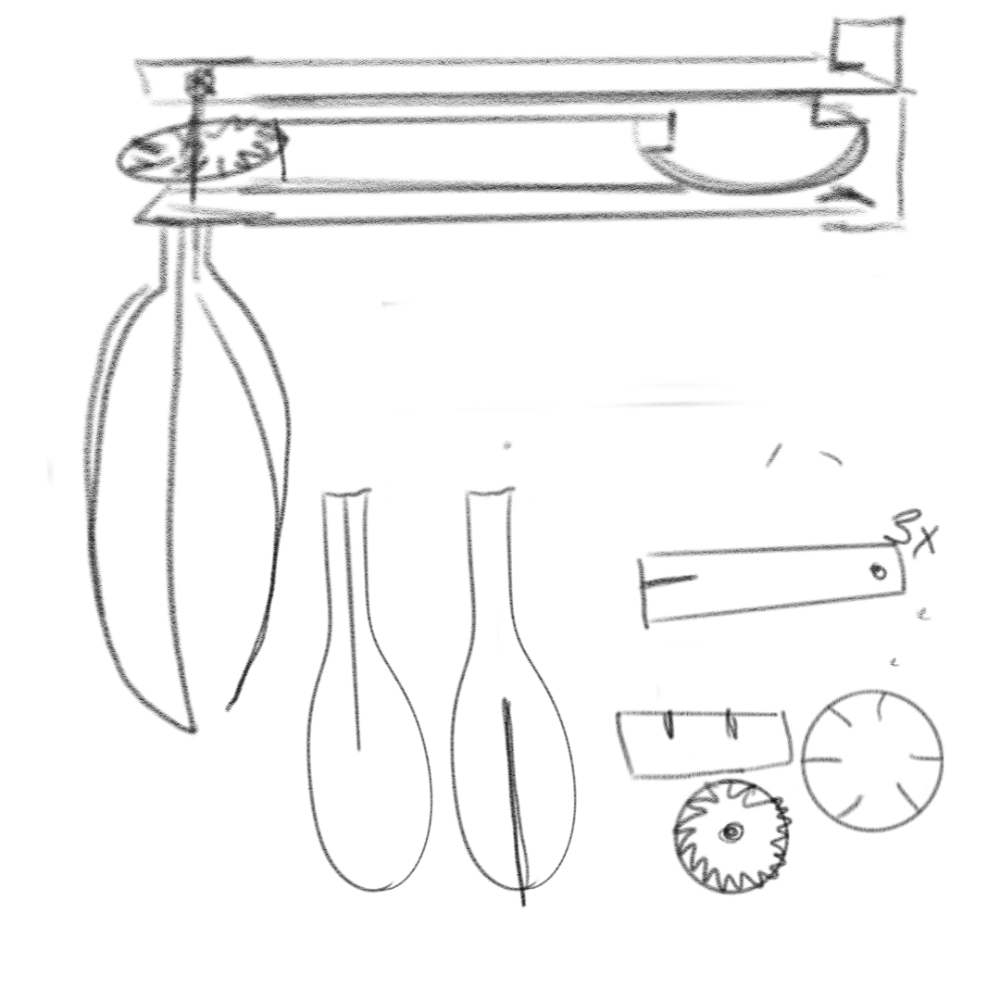
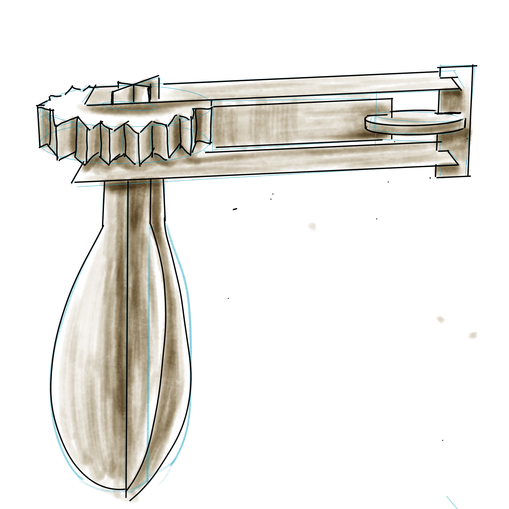
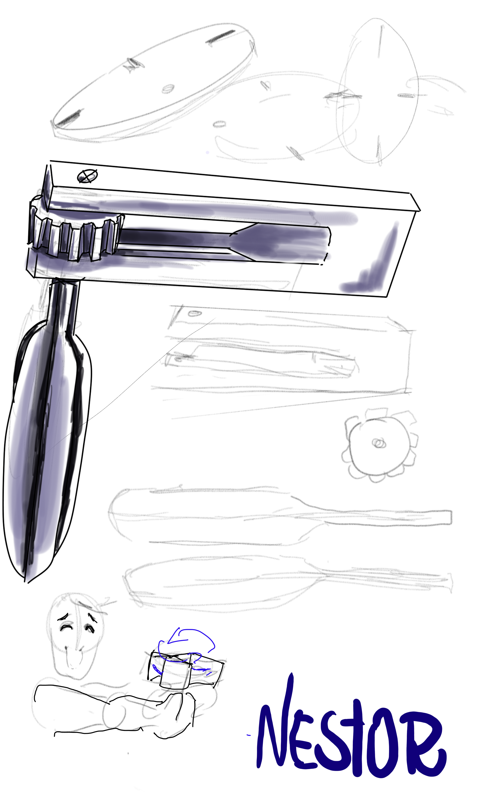
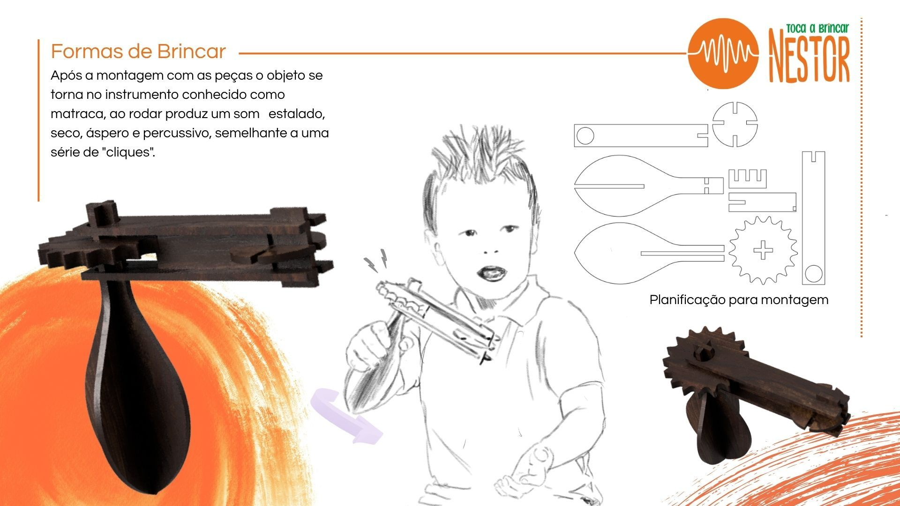

# Processo

## 1. Modelos 3D

Embed do Fusion (visualização do modelo paramétrico).

https://a360.co/4nqYoPa

## 2. Outros Modelos

Modelos físicos exploratórios, em cartão, espuma, madeira de teste.

## 3. Esboços e Pranchas-Resumo

Desenhos manuais, 
pranchas A3 de síntese, 
exploração de variantes.

## 4. Pesquisa

### 4.1. Aspectos valorizados do moodboard, desconstrução da forma (o que distingue o programa formal)

### 4.2. Objetos de referencia

Inventário de precedentes, brinquedos análogos, referências históricas.

## 5. Outros Elementos

Outros materiais relevantes para a preparação do conceito (entrevistas, observação, testes com utilizadores, notas, leituras, inspirações).
