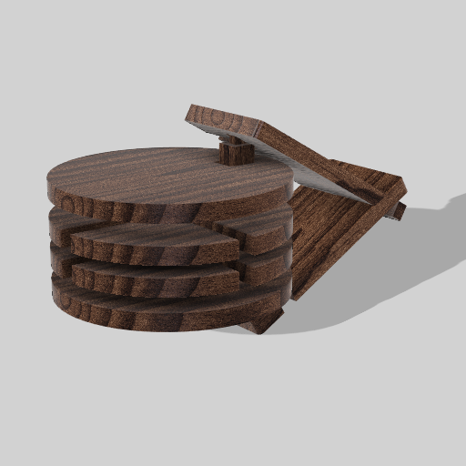
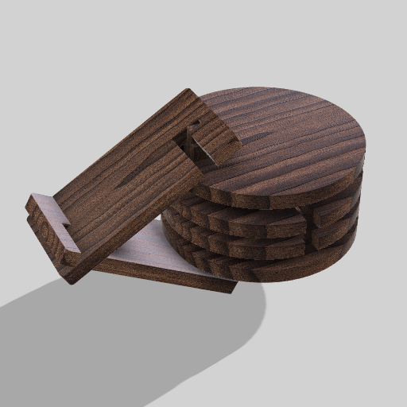

# Processo

## 1. Protótipo/ Versão Final

As imagens que seguem foram capturadas recorrendo ao software Autodesk Fusion 360 do modelo 3D final do brinquedo dada a impossibilidade de realizar os protótipos finais atempadamente.

## 2. Modelos 3D

[https://a360.co/48V5CF7](https://a360.co/48V5CF7 "https://a360.co/48V5CF7")

## 3. Outros Modelos

Foi primeiramente realizado uma maquete de cartão que serviu para testar o sistema de encaixes e o tamanho das peças. Neste momento não temos nenhuma imagem disponível desta maquete ao que a mesma encontra-se inutilizável e não se realizou nenhum registo fotográfico antes do seu descarte. 
No entanto, a maquete permitiu perceber que seria necessário ajustar algumas medidas e procurar outras soluções mais eficientes para os encaixes.
## 4. Esboços e Pranchas-Resumo

### 4.1. Prancha-Resumo inicial

### 4.2. Prancha-Resumo final

## 5. Pesquisa

### 5.1. Objetos de referencia

	castanholas típicas da Madeira 

	tazos