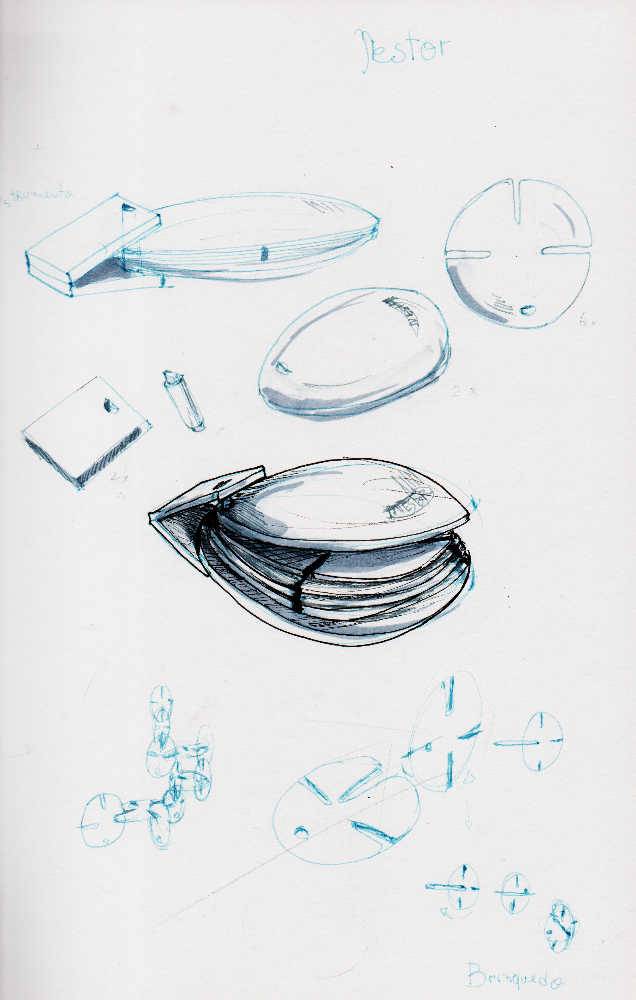
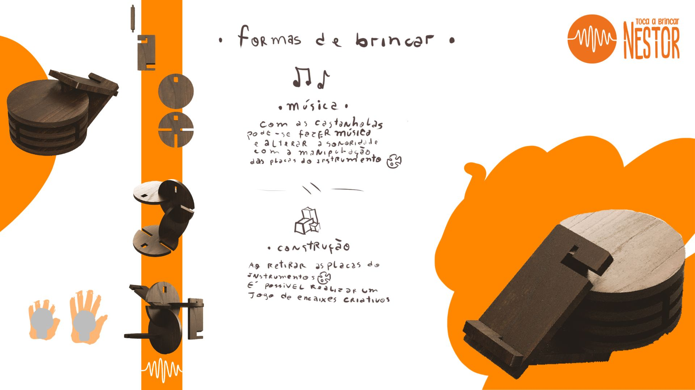

# Processo

## 1. Modelos 3D

[https://a360.co/48V5CF7](https://a360.co/48V5CF7 "https://a360.co/48V5CF7")

## 2. Outros Modelos

Foi primeiramente realizado uma maquete de cartão que serviu para testar o sistema de encaixes e o tamanho das peças. Neste momento não temos nenhuma imagem disponível desta maquete ao que a mesma encontra-se inutilizável e não se realizou nenhum registo fotográfico antes do seu descarte. 
No entanto, a maquete permitiu perceber que seria necessário ajustar algumas medidas e procurar outras soluções mais eficientes para os encaixes.
## 3. Esboços e Pranchas-Resumo

## 4. Pesquisa

### 4.1. Aspectos valorizados do moodboard, desconstrução da forma (o que distingue o programa formal)

### 4.2. Objetos de referencia

- castanhola madeirense 
inserir imagem
- tazos
inserir imagem
