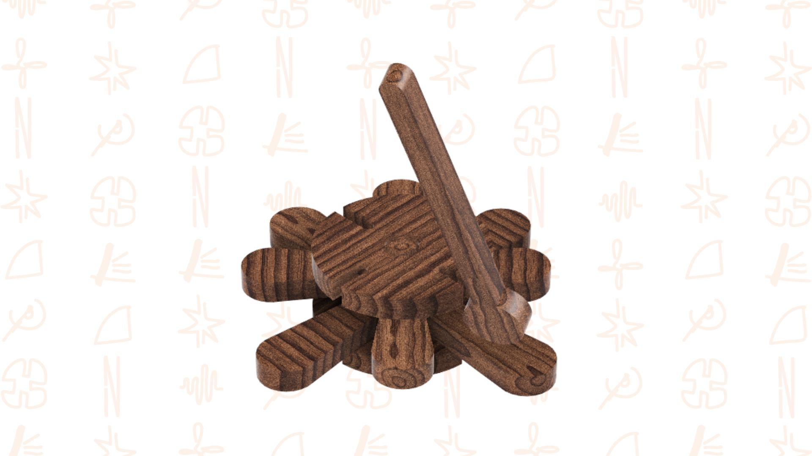
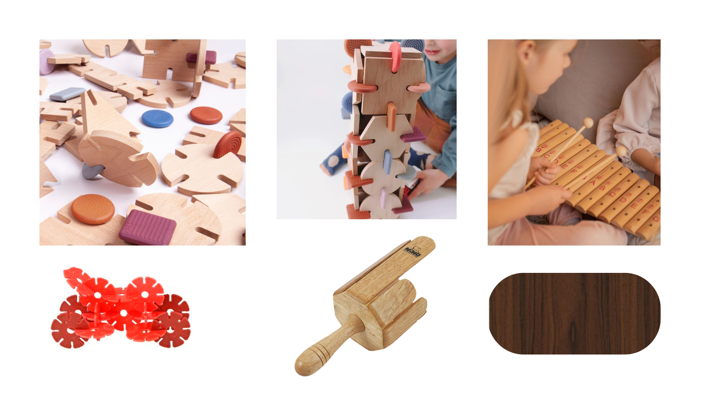
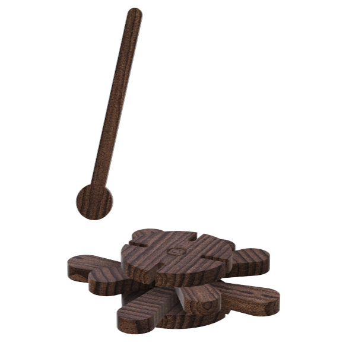
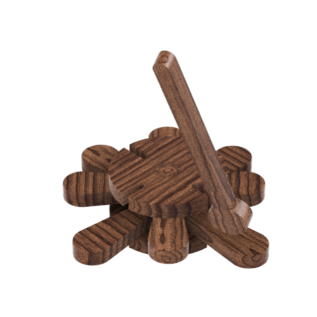

# Xilofone Flor

> A música que floresce da madeira.

## Conceito

O Xilofone Flor da Nestor consiste num brinquedo de madeira que assume dois modos de interação distintos:
- o contacto com um instrumento musical.
- a brincadeira de encaixes com e entre as peças dos brinquedos *Toca a Brincar!* da Nestor.

Este brinquedo é direcionado para crianças a partir dos 3 anos, de modo a que, através destas componentes interativas consiga impulsionar a sua criatividade. Combinando o som melódico e uma modularidade de construção livre o Xilofone Flor não coloca entrave algum à liberdade do modo de brincar às crianças.

Projeta-se que este brinquedo, e os restantes da linha *Toca a Brincar* da Nestor, sejam aplicados em contexto escolar e educacional para um melhor enriquecimento musical e cognitivo das crianças tal como o fortalecimento das suas relações entre si através duma atividade coletiva proporcionada pela música.

	*moodboard* de referências visuais

## Enquadramento

O Xilofone Flor integra a coleção de brinquedos da linha *Toca a Brincar!* da marca Nestor segundo um Design aberto e distribuído. O projeto segue o propósito de dar vida a brinquedos de madeira provenientes dos restos de madeira de mobílias, incentivando o reaproveitamento de materiais e a sustentabilidade. 

É através da linguagem musical e da combinação de peças com os encaixes comuns que os brinquedos desta linha interagem uns com os outros, no entanto o Xilofone Flor destaca-se pela sua forma inédita e original capaz de produzir sons diversos e melodias com 8 notas musicais!

Para uma melhor contextualização do ramo *Toca a Brincar!* veja o seu [contexto](../../contexto.md).

## Tecnologia

- Material - madeira de nogueira dos restos do mobiliário da [Dutch Craft Furniture](https://dutchcraftfurniture.com/collections/vendors?q=Dutch%20Craft%20Furniture).
- Fabricação digital proveniente do desenho paramétrico e modular realizado com o software Autodesk Fusion 360 segundo as restrições impostas pela tecnologia CNC (bidimensionalidade do corte).
- Fabrico com o recurso à tecnologia CNC para o corte das peças e criação de sistemas de encaixes precisos.

- Modelo 3D: https://a360.co/4fSgmIu
- Ficheiros: `attachments/`

## Função

Desenhado de modo a integrar um contexto pedagógico e estimulante das capacidades cognitivas e criativas das crianças, o Xilofone Flor proporciona diferentes modos de interação graças à sua componente musical e lúdica.

O brinquedo procura cativar as crianças e manter o seu interesse intacto com o decorrer do tempo com a sua pluralidade de usos, funcionando a solo ou em conjunto com os restantes brinquedos e instrumentos da gama *Toca a Brincar!*.

Numa nota mais técnica, o brinquedo assume no seu design e no decorrer seu processo de fabrico a importância da segurança definidas pelas Diretivas de Segurança de Brinquedos da UE (Diretiva 2009/48/CE), refletindo-se das seguintes formas:

- adequação à idade.
- segurança física e mecânica dado ao dimensionamento cuidadoso das peças e a ausência bicudas ou cortantes.
- segurança dos materiais através do recurso a madeiras apropriadas e não tóxicas.

## Apresentação

---

## Processo

O percurso completo de iterações, modelos e pesquisa está em [processo.md](processo.md), organizado do **mais recente** para o **mais antigo**.

[Ver processo completo →](processo.md)
