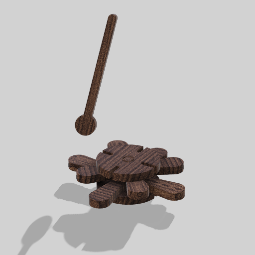
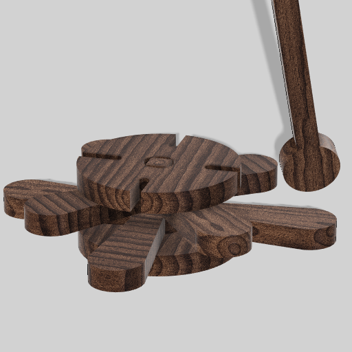

# Processo

## 1. Protótipo/ Versão Final

As imagens que seguem foram capturadas recorrendo ao software Autodesk Fusion 360 do modelo 3D final do brinquedo dada a impossibilidade de realizar os protótipos finais atempadamente.

## 2. Processo de Prototipagem

Maquinação CNC, montagem, acabamentos pontuais. 

## 3. Protótipos Exploratórios

### 3.1. Protótipo exploratório nº.1 

Foi realizado um protótipo, ainda num modelo muito simples no que toca à forma e até mesmo da escala, com o intuito de experimentar e dar a entender melhor os encaixes e a funcionalidade do brinquedo.

	Protótipo acabado de cortar na CNC Ouplan STEEL 3020 no Fablab Benfica

	Teste de montagem das peças do protótipo experimental

	Teste de montagem das peças do protótipo experimental

Apesar de no fim do processo do corte na CNC ter ocorrido um problema (devido à incompatibilidade da espessura do material com o modo de preparação do ficheiro que foi para o corte) que resultou na deformação duma das peças, o resultado ainda me permitiu perceber o que desejava - o funcionamento dos encaixes e ideias gerais do formato do brinquedo e que outras abordagens poderia vir a seguir.

Deste modo, recorrendo apenas a este protótipo exploratório cheguei às seguintes conclusões:
- os encaixes precisariam duma maior folga entre si (cerca de mais 1 ou 2 mm) para que as peças consigam encaixar até ao fim. 
- as peças teriam que ser redimensionadas, para que a altura das peças eixo (os dois retângulos) consiga abranger todas as peças das lâminas (restantes peças com forma de lupa).
- em alternativa ao ponto anterior - procurar uma abordagem e formato diferente às peças de modo a reduzir a quantidade de peças para simplificar o processo de corte e o formato geral do brinquedo, ao que após este teste verifiquei que não era bem esta o formato que queria seguir.

### 3.2. Protótipo exploratório nº.2

O segundo protótipo já foi um modelo em maior conformidade com as devidas alterações realizadas com base nas observações e aprendizagens feitas com o 1º protótipo exploratório. Apesar de protótipo se apresentar incompleto (falta de uma das peças das lâminas) e possuir algumas falhas que veremos de seguida, este é, também, o que mais se aproxima a um protótipo final do brinquedo Xilofone Nestor. 

	Protótipo do Xilofone Nestor parcialmente montado para uma melhor leitura das peças que o constituem e do seu modo de montagem

	 Protótipo completamente montado

	Protótipo a ser manuseado - relação à escala humana

	Protótipo a ser manuseado - rotação da peça das lâminas segundo o eixo central

Através deste protótipo conseguimos ter uma melhor interpretação daquele que é o seu aspeto mais completo e montado e como se comporta num contexto de uso e de brincadeira. Podemos então constatar: 

- o aumento da escala das peças e a sua relação com a escala humana no seu contexto de uso.
- a modificação das peças das lâminas para um formato mais simples e uniforme, fazendo com que em vez de se fazer 1 peça para cada uma das lâminas para cada nota musical (por isso, 8 peças no total apenas para as lâminas) fazer-se apenas 2 peças para as 8 notas musicais (4 notas para cada peça).
- a introdução dum novo elemento - a baqueta - para a criação de som com as lâminas.

Com base nas aprendizagens obtidas com este 2º protótipo, estas são as mudanças ligeiras que gostaria de vir a fazer numa versão mais final e completa do brinquedo:

- realização dum corte correto e completo (com todas as peças do ficheiro), com uma madeira mais densa e adequada à causa, para que se possa explorar, em detalhe, questões como a afinação das lâminas dado que as suas medidas neste protótipo e no ficheiro atual (junho de 2026), estão definidas com base na formula aplicada para a obtenção duma frequência diferente para cada uma das notas/lâminas. Mais sobre este processo no ponto `6.2. Objetos de referência.`
- alteração ligeira dalgumas das peças, de modo a acrescentar mais encaixes da linha "Toca a Brincar!" da Nestor (encaixes tipo tazos), para que possa haver uma maior interação e relação com os outros brinquedos (a Matraca e as Castanholas) e as suas respetivas peças. Segue-se uma representação ilustrativa com as respetivas alterações:

## 4. Modelos 3D

https://a360.co/4fSgmIu

## 5. Esboços e Pranchas-Resumo

### 5.1. *Tonette Puzzle*

	Primeiros esboços alusivos à primeira ideia para o meu brinquedo

Os primeiros esboços feitos para este projeto, à semelhança do projeto atual, tinham como tema base a música. Deste modo a ideia consistia em criar um brinquedo de madeira que se assemelharia ao instrumento musical *tonette* - um instrumento de sopro que funciona como uma flauta pequena de plástico que surgiu nos anos 30 como uma opção simples e barata para ensinar música nas escolas dos Estados Unidos (fonte: https://en.wikipedia.org/wiki/Tonette).

	*Swanson tonette*

A *Tonette Puzzle* seria então a apropriação deste instrumento de sopro para um brinquedo de madeira que se desconstruiria em peças diversas que funcionariam como um puzzle.
Deste modo a *Tonette Puzzle* proporcionaria as seguintes dinâmicas e opcções de brincadeiras:

- instrumento de sopro;
- dois puzzles distintos - o puzzle que daria forma à *Tonette* e um outro puzzle mais livre e sem forma definida que graças aos encaixes das peças, poderiam interagir e complementar os restantes brinquedos da linha *Toca a Brincar!*, nomeadamente as Maracas e a Matraca.

Ao tentar aplicar esta ideia com base na carpintaria digital, várias questões impeditivas foram surgindo fazendo com que fosse explorar opções e abordagens diferentes para este brinquedo. Dentro dos pontos que foram surgindo, estes foram alguns dos que determinaram a impossibilidade de dar seguimento à *Tonette Puzzle*:

- a brincadeira com a *Tonette* poderia vir a criar alguns constrangimentos e até causar alguma frustração dado que o sopro necessário para a produção de som com o brinquedo é uma questão que requer alguma técnica que as crianças até aos 7 anos por norma ainda não dominam muito bem.
- a partir dum certo ponto senti que com este projeto estava a tentar fazer de tudo um pouco, mas que efetivamente não estaria a dominar nenhuma das brincadeiras que proporcionaria, fazendo com que o seu propósito acabasse por ficar confuso e desinteressante para as crianças.

### 5.2. Xilofone Flor Nestor

Em seguimento, fui desenvolvendo os esboços que serviriam como base para aquele que é o atual Xilofone Flor, cujo processo de desenvolvimento e experimentação foi previamente abordado nos pontos anteriores.

	Esboços do Xilofone Flor

### 5.3. Prancha Resumo Final

## 6. Pesquisa

### 6.1. Aspectos valorizados do moodboard, desconstrução da forma (o que distingue o programa formal)

### 6.2. Objetos de referência

Tendo como referência um xilofone de madeira, realizei uma pesquisa que teve como objetivo definir o tamanho das lâminas das notas musicais do Xilofone Flor.

	Xilofone de referência - vista de cima
  

	Xilofone de referência - vista de lado duma das lâminas

Após ter feito uma recolha de informações e medidas de cada uma das lâminas obtive os seguintes dados:

Tamanho das lâminas
- dó -195 mm
- ré - 186 mm
- mi - 174 mm
- fá - 168 mm
- sol - 158 mm
- lá - 148 mm
- si - 142 mm
- dó - 137 mm
- ré - 130 mm
- mi - 121 mm
- fá - 118 mm

- espessura nos cantos - 7mm
- esp mínima no centro - 3mm
- comprimento do rebaixo - 65mm

Numa pesquisa posterior a esta, deparei-me com os relatos e resultados de outras pessoas que já haviam feito esta mesma pesquisa que eu de modo a definir as dimensões corretas das barras para um xilofone de madeira. 
Assim, pude encontrar uma formula/equação que acabei então por experimentar com os dados recolhidos anteriormente com o xilofone de referência, tendo acabado por confirmar que o mesma seria de facto a formula de cálculo mais acertada, sendo que, é necessário ter em consideração que as lâminas ainda precisariam de serem trabalhadas mais a detalhe para que possam ser afinas a melhor detalhe e precisão para alcançar a frequência correta/desejada.

A formula consiste no seguinte:

- dimensão necessária = raiz quadrada da (dimensão atual * dimensão atual * frequência atual / frequência desejada)

Simplificando: 

- dn = √(da² * fa / fd)

Fonte: # [How to calculate the size of a xylophone bar according to its pitch](https://music.stackexchange.com/questions/16441/how-to-calculate-the-size-of-a-xylophone-bar-according-to-its-pitch)

Deste modo, acabei por recorrer a esta formula de calculo para me ajudar a definir as diferentes dimensões para cada uma das minhas lâminas de modo a corresponderem às respetivas notas musicais segundo uma tabela de frequências de notas musicais (# [Music note to frequency chart](https://mixbutton.com/music-tools/frequency-and-pitch/music-note-to-frequency-chart)). Tendo assim obtido os resultados seguintes:

- fc4 (dó) = 261.63 Hz = 83 mm
- fd4 (ré) = 293.66 Hz = 78 mm
- fe4 (mi) = 329.63 Hz = 74 mm
- ff4 (fá) = 349.23 Hz = 72 mm
- fg4 (sol) = 392 Hz = 68 mm
- fa4 (lá) = 440 Hz = 64 mm
- fb4 (si) = 493.88 Hz = 60 mm
- fc5 (dó) = 523.25 Hz = 58 mm

## 7. Outros Elementos

Parizzi, B., Rodrigues, H. (2020). _O BEBÊ E A MÚSICA._ Instituto Langage.