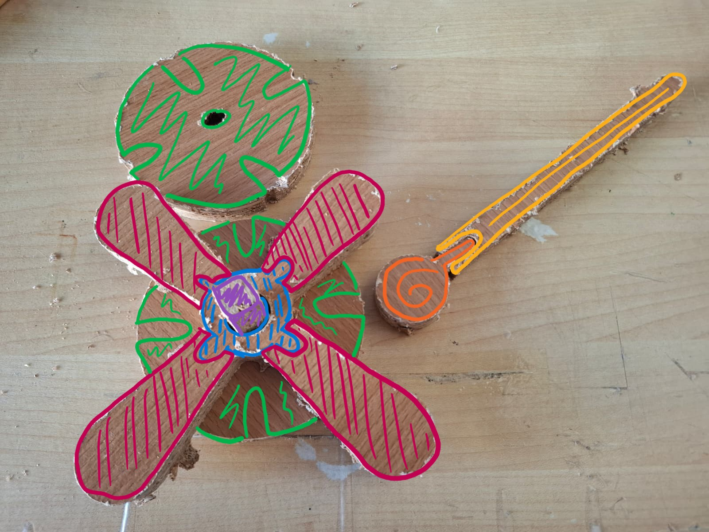

# Processo

## 1.

## 2. Processo de Prototipagem

Maquinação CNC, montagem, acabamentos pontuais. 

## 3. Protótipos Exploratórios

### 3.1. Protótipo exploratório nº.1 

Foi realizado um protótipo, ainda num modelo muito simples no que toca à forma e até mesmo da escala, com o intuito de experimentar e dar a entender melhor os encaixes e a funcionalidade do brinquedo.

	Protótipo acabado de cortar na CNC Ouplan STEEL 3020 no Fablab Benfica

	Teste de montagem das peças do protótipo experimental

	Teste de montagem das peças do protótipo experimental

Apesar de no fim do processo do corte na CNC ter ocorrido um problema (devido à incompatibilidade da espessura do material com o modo de preparação do ficheiro que foi para o corte) que resultou na deformação duma das peças, o resultado ainda me permitiu perceber o que desejava - o funcionamento dos encaixes e ideias gerais do formato do brinquedo e que outras abordagens poderia vir a seguir.

Deste modo, recorrendo apenas a este protótipo exploratório cheguei às seguintes conclusões:
- os encaixes precisariam duma maior folga entre si (cerca de mais 1 ou 2 mm) para que as peças consigam encaixar até ao fim. 
- as peças teriam que ser redimensionadas, para que a altura das peças eixo (os dois retângulos) consiga abranger todas as peças das lâminas (restantes peças com forma de lupa).
- em alternativa ao ponto anterior - procurar uma abordagem e formato diferente às peças de modo a reduzir a quantidade de peças para simplificar o processo de corte e o formato geral do brinquedo, ao que após este teste verifiquei que não era bem esta o formato que queria seguir.

### 3.2. Protótipo exploratório nº.2

O segundo protótipo já foi um modelo em maior conformidade com as devidas alterações realizadas com base nas observações e aprendizagens feitas com o 1º protótipo exploratório. Apesar de protótipo se apresentar incompleto (falta de uma das peças das lâminas) e possuir algumas falhas que veremos de seguida, este é, também, o que mais se aproxima a um protótipo final do brinquedo Xilofone Nestor. 

	Protótipo do Xilofone Nestor parcialmente montado para uma melhor leitura das peças que o constituem e do seu modo de montagem

	 Protótipo completamente montado

	Protótipo a ser manuseado - relação à escala humana

	Protótipo a ser manuseado - rotação da peça das lâminas

Através deste protótipo conseguimos ter uma melhor interpretação daquele que é o seu aspeto mais completo e montado e como se comporta num contexto de uso e de brincadeira. Podemos então constatar: 

- o aumento da escala das peças e a sua relação com a escala humana no seu contexto de uso.
- a modificação das peças das lâminas para um formato mais simples e uniforme, fazendo com que em vez de se fazer 1 peça para cada uma das lâminas para cada nota musical (por isso, 8 peças no total apenas para as lâminas) fazer-se apenas 2 peças para as 8 notas musicais (4 notas para cada peça).
- a introdução dum novo elemento - a baqueta - para a criação de som com as lâminas.

Com base nas aprendizagens obtidas com este 2º protótipo, estas são as mudanças ligeiras que gostaria de vir a fazer numa versão mais final e completa do brinquedo:

- realização dum corte correto e completo (com todas as peças do ficheiro), com uma madeira mais densa e adequada à causa, para que se possa explorar, em detalhe, questões como a afinação das lâminas dado que as suas medidas neste protótipo e no ficheiro atual (junho de 2026), estão definidas com base na formula aplicada para a obtenção duma frequência diferente para cada uma das notas/lâminas. Mais sobre este processo no ponto `6.2. Objetos de referência.`
- alteração ligeira dalgumas das peças, de modo a acrescentar mais encaixes da linha "Toca a Brincar!" da Nestor (encaixes tipo tazos), para que possa haver uma maior interação e relação com os outros brinquedos (a Matraca e as Castanholas) e as suas respetivas peças. Segue-se uma representação ilustrativa com as respetivas alterações:

## 4. Modelos 3D

https://a360.co/4nqYoPa

## 5. Esboços e Pranchas-Resumo

## 6. Pesquisa

### 6.1. Aspectos valorizados do moodboard, desconstrução da forma (o que distingue o programa formal)

### 6.2. Objetos de referência
Foi realizada uma pesquisa relativa ao modo 

## 7. Outros Elementos

Outros materiais relevantes para a preparação do conceito (entrevistas, observação, testes com utilizadores, notas, leituras, inspirações).

Parizzi, B., Rodrigues, H. (2020). _O BEBÊ E A MÚSICA._ Instituto Langage.