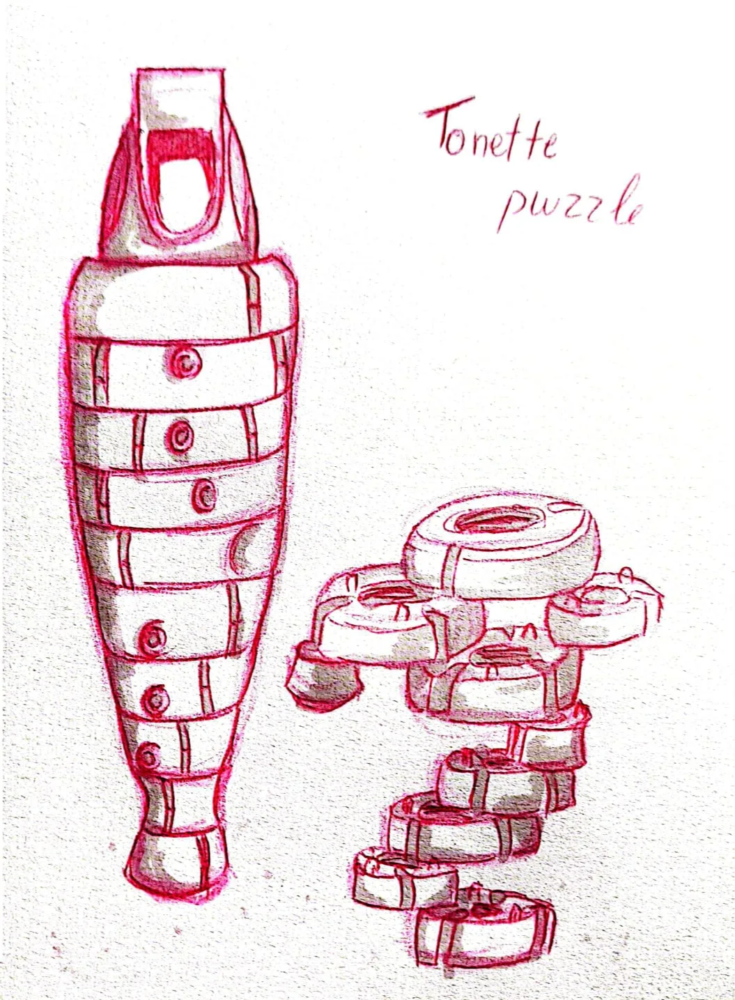
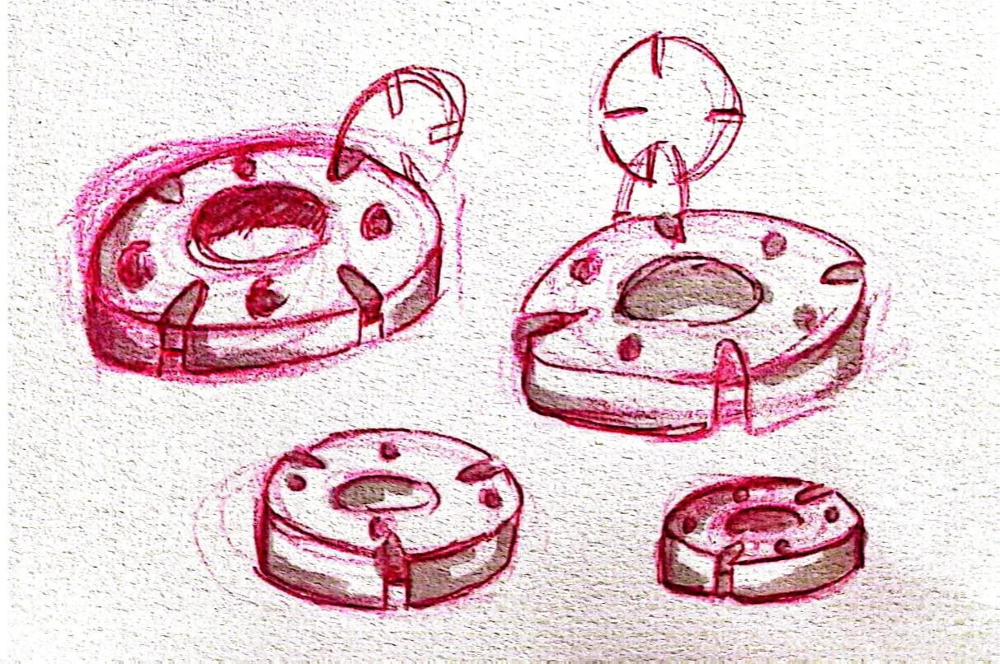
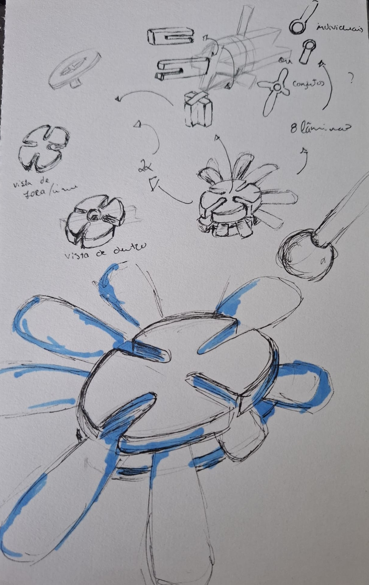
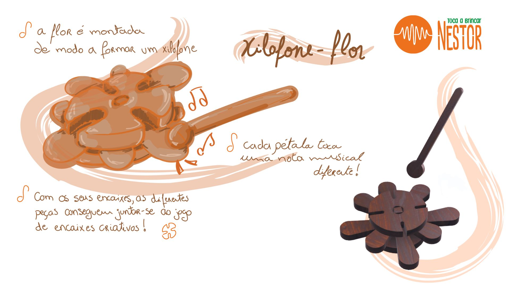

# Processo

## 1. Processo de Prototipagem

Maquinação CNC, montagem, acabamentos pontuais. 

## 2. Protótipos Exploratórios

Foi realizado um protótipo, ainda num modelo muito simples no que toca à forma e até mesmo da escala, com o intuito de experimentar e dar a entender melhor os encaixes e a funcionalidade do brinquedo.

	Protótipo acabado de cortar na CNC Ouplan STEEL 3020 no Fablab Benfica

	Teste de montagem das peças do protótipo experimental

	Teste de montagem das peças do protótipo experimental

Apesar de no fim do processo do corte na CNC ter ocorrido um problema (devido à incompatibilidade da espessura do material com o modo de preparação do ficheiro que foi para o corte) que resultou na deformação duma das peças, o resultado ainda me permitiu perceber o que desejava - o funcionamento dos encaixes e ideias gerais do formato do brinquedo e que outras abordagens poderia vir a seguir.

Deste modo, recorrendo apenas a este protótipo exploratório cheguei às seguintes conclusões:
- os encaixes precisariam duma maior folga entre si (cerca de mais 1 ou 2 mm) para que as peças consigam encaixar até ao fim. 
- as peças teriam que ser redimensionadas, para que a altura das peças eixo (os dois retângulos) consiga abranger todas as peças das lâminas (restantes peças com forma de lupa).
- em alternativa ao ponto anterior - procurar uma abordagem e formato diferente às peças de modo a reduzir a quantidade de peças para simplificar o processo de corte e o formato geral do brinquedo, ao que após este teste verifiquei que não era bem esta o formato que queria seguir.

## 3. Modelos 3D

https://a360.co/4nqYoPa

## 4. Outros Modelos

Modelos físicos exploratórios, em cartão, espuma, madeira de teste.

## 5. Esboços e Pranchas-Resumo

## 6. Pesquisa

### 6.1. Aspectos valorizados do moodboard, desconstrução da forma (o que distingue o programa formal)

### 6.2. Objetos de referencia
Foi realizada uma pesquisa relativa ao modo 

## 7. Outros Elementos

Outros materiais relevantes para a preparação do conceito (entrevistas, observação, testes com utilizadores, notas, leituras, inspirações).

Parizzi, B., Rodrigues, H. (2020). _O BEBÊ E A MÚSICA._ Instituto Langage.